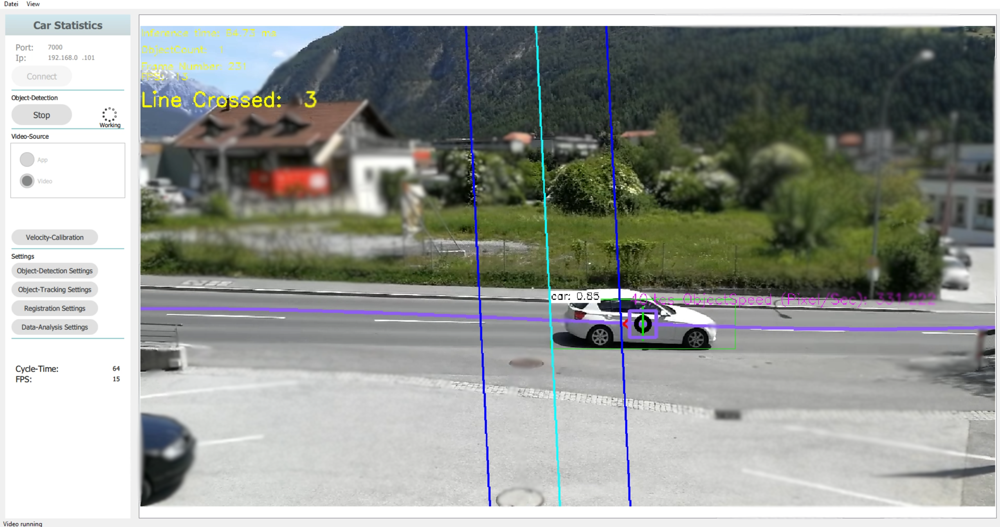

# portfolio
I present here a collection of my projects and creations. [linkedin](https://www.linkedin.com/in/florian-f%C3%BCrrutter-a4b7b2142/)

## Raytracing with NVIDIA OPTIX™
Creating a custom raytracing render engine for displaying photo realistic real time simulations on the GPU.

**Keywords**: raytracing, CUDA, optix, PBR, real time rendering, GPU

Used technologies:
- [C++ 20](https://isocpp.org/)
- [CUDA v11.x](https://developer.nvidia.com/cuda-zone)
- [OptiX 7.x](https://developer.nvidia.com/optix)
- [OpenGL](https://www.opengl.org/)
- [Dear ImGui](https://github.com/ocornut/imgui)
- [GLFW](https://github.com/glfw/glfw)
- [assimp](https://github.com/assimp/assimp)

## First entries into simulation
Exploring Newtonian simulations.

**Keywords**: simulation, CUDA, GPU

Used technologies:
- [C++ 20](https://isocpp.org/)
- [CUDA v11.x](https://developer.nvidia.com/cuda-zone)
- [NVIDIA® GVDB Voxels](https://github.com/NVIDIA/gvdb-voxels)

## Blender
Experimenting with blender and the Tyrolean-Geographic information system (Datenquelle: Land Tirol - data.tirol.gv.at)

**Keywords**: Blender, GIS, rendering

Used technologies:
- [Blender](https://www.blender.org/)
- [QGIS](https://www.qgis.org/de/site/index.html)

## Pepper (robot) / face recognition
Working at [*Casablanca*](https://www.casablanca.at/) implementing a face recognition system for the Pepper (robot) by [*SoftBank*](https://group.softbank/en).

**Keywords**: image processing, OpenCV, neural network

Used technologies:
- [C++ 17](https://isocpp.org/)
- [C#](https://docs.microsoft.com/en-us/dotnet/csharp/)
- [OpenCV](https://github.com/opencv/opencv)
- [Java, Android](https://www.java.com/)
- [Python](https://www.python.org/)
- [Keras](https://keras.io/)
- [TensorFlow](https://www.tensorflow.org/)

## Automatic Traffic-Statistics 
Aims to create a Desktop- and Mobile-Application to count passing cars. With these numbers a detailed traffic analysis is generated.

**Keywords**: image processing, GUI, Qt, automation, OpenCV, neural network

Used technologies:
- [C++ 17](https://isocpp.org/)
- [OpenCV](https://github.com/opencv/opencv)
- [Qt, QML](https://www.qt.io/)
- [SQL, SQLite](https://www.sqlite.org/index.html)

## Engineering College Thesis (*HTL-Diplomarbeit*)
My Thesis for acquiring the engineer title. In cooperation with [*Swarovski*](https://www.swarovski.com). 

**Abstract**:
Some crystal glassware of Swarovski is marked by means of laser engraving. The 
quality control of the engravings is currently done manually by random sampling. This manual quality assurance does not meet the Swarovski quality standards any more. In addition, it does not prevent the delivery of inferior goods to customers. 
The manual verification of the engravings should be replaced with an automated image processing system. The design of a concept and development is part of the project. The intention of the project is a finished prototype which fully automatically verifies the engraving of a manually inserted crystal using image processing software. In this way, a detection of inferior crystals according to clearly defined quality standards is possible. The software is able to get images from the camera and execute analyzing algorithms. 

**Keywords**: image processing, GUI, Qt, automation, OpenCV, SQL

Used technologies:
- [C++ 17](https://isocpp.org/)
- [OpenCV](https://github.com/opencv/opencv)
- [Qt, QML](https://www.qt.io/)
- [SQL, MariaDB](https://mariadb.org/)
- [Basler (API and Camera)](https://www.baslerweb.com/de/)

## Others
And many others ...

### Neural networks
Exploring some neural nets, especially GAN types.

**Keywords**: neural network, Keras, Tensorflow

Used technologies:
- [Python](https://www.python.org/)
- [Keras](https://keras.io/)
- [TensorFlow](https://www.tensorflow.org/)

### Uni Laboratory example: Measurement speed of light
Using a camera and a rotating mirror setup

**Keywords**: image processing, optics, physics

Used technologies:
- [Python](https://www.python.org/)
- [OpenCV](https://github.com/opencv/opencv)
- [LaTeX](https://www.latex-project.org/)

___
 This work is licensed under a <a rel="license" href="http://creativecommons.org/licenses/by-nc-nd/4.0/">Creative Commons Attribution-NonCommercial-NoDerivatives 4.0 International License</a>.
